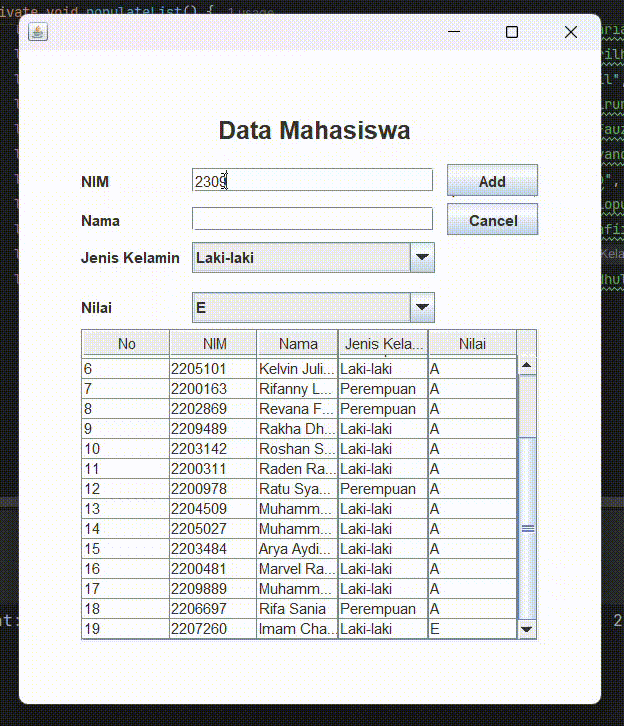

# TP4DPBO2025C1

Saya Rexy Putra Nur Laksana dengan NIM 2309578 mengerjakan soal TP 4 dalam mata kuliah Desain dan Pemrograman Berorientasi Objek untuk keberkahanNya maka saya tidak melakukan kecurangan seperti yang telah dispesifikasikan. Aamiin.

# Desain Program
- **Input Form** :
  - **NIM**: Input field untuk memasukkan Nomor Induk Mahasiswa  
  - **Nama**: Input field untuk memasukkan nama mahasiswa  
  - **Jenis Kelamin**: Dropdown untuk memilih jenis kelamin  
  - **Nilai**: Dropdown untuk memilih nilai mahasiswa
  - **Tombol Add**: Untuk menambahkan input data  
  - **Tombol Update**: Untuk mengupdate input data  
  - **Tombol Delete**: Untuk mendelete input data  
  - **Tombol Cancel**: Untuk membatalkan aksi add, update atau delete  

- **Tabel Mahasiswa**:  
  - Menampilkan daftar mahasiswa dengan kolom **No, NIM, Nama, Jenis Kelamin, dan Nilai**  
  - Data di tabel diperbarui secara otomatis setiap kali ada perubahan seperti Add, Update, Delete

# Alur
### 1. **Inisialisasi Program**

- Program dimulai dengan membuat objek Menu, mengatur ukuran dan tampilan jendela, serta menampilkan GUI menggunakan JFrame.

### 2. **Inisialisasi Komponen GUI**

- Tabel (JTable): Menampilkan daftar mahasiswa.
- Form Input (JTextField, JComboBox): Untuk mengisi data mahasiswa (NIM, Nama, Jenis Kelamin, Nilai).
- Tombol (JButton):
  - "Add/Update" → Menambahkan atau memperbarui data.
  - "Delete" → Menghapus data.
  - "Cancel" → Mengosongkan form.

### 3. **Mengisi Data Awal**

- Data awal mahasiswa dimasukkan ke dalam ArrayList<Mahasiswa>, kemudian ditampilkan dalam tabel.

## 4. **Interaksi Pengguna**

- Tambah Data
  - Pengguna mengisi form dan menekan tombol "Add".
  - Data baru ditambahkan ke dalam ArrayList, tabel diperbarui, dan form dikosongkan.
- Pilih Data di Tabel
  - Jika baris tabel diklik, form akan terisi dengan data dari baris tersebut.
  - Tombol "Add" berubah menjadi "Update", dan tombol "Delete" ditampilkan.
- Edit Data
  - Jika tombol "Update" ditekan, data mahasiswa di dalam ArrayList diperbarui sesuai input form.
  -Tabel diperbarui, form dikosongkan, dan tombol kembali ke mode "Add".
- Hapus Data
  - Jika tombol "Delete" ditekan, program meminta konfirmasi.
  - Jika disetujui, data dihapus dari ArrayList, tabel diperbarui, dan form dikosongkan.
- Batalkan Aksi
  - Jika tombol "Cancel" ditekan, semua input di form dikosongkan dan tombol kembali ke mode "Add".

### 5. **Pembaruan Tampilan**

- Setelah setiap aksi (Tambah, Edit, Hapus), tabel diperbarui dengan data terbaru dari ArrayList.

### 6.**Program Berjalan Hingga Ditutup**

- Program terus berjalan hingga jendela ditutup (JFrame.EXIT_ON_CLOSE).

# Dokumentasi

